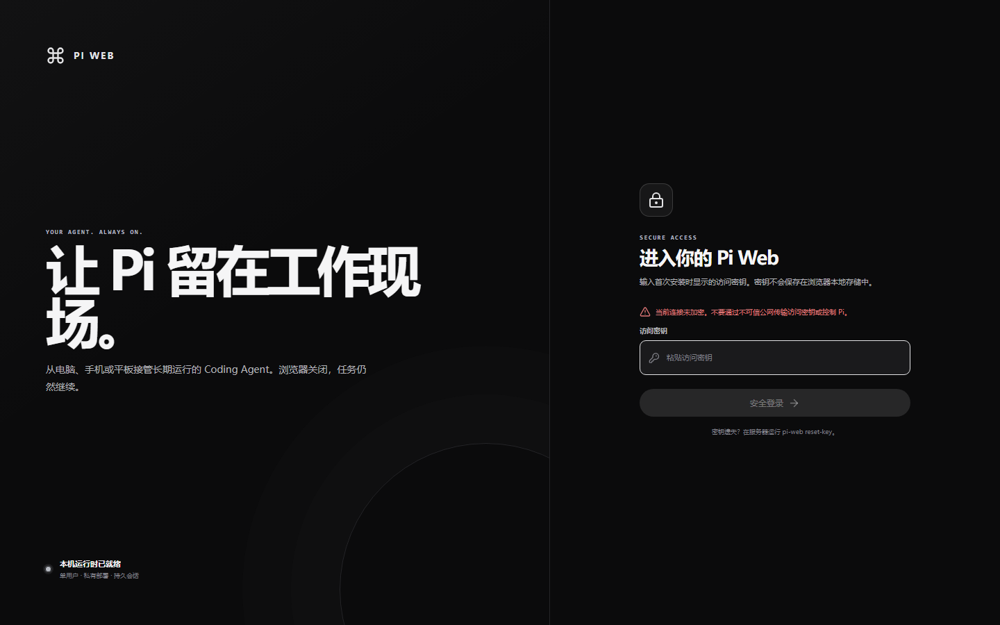
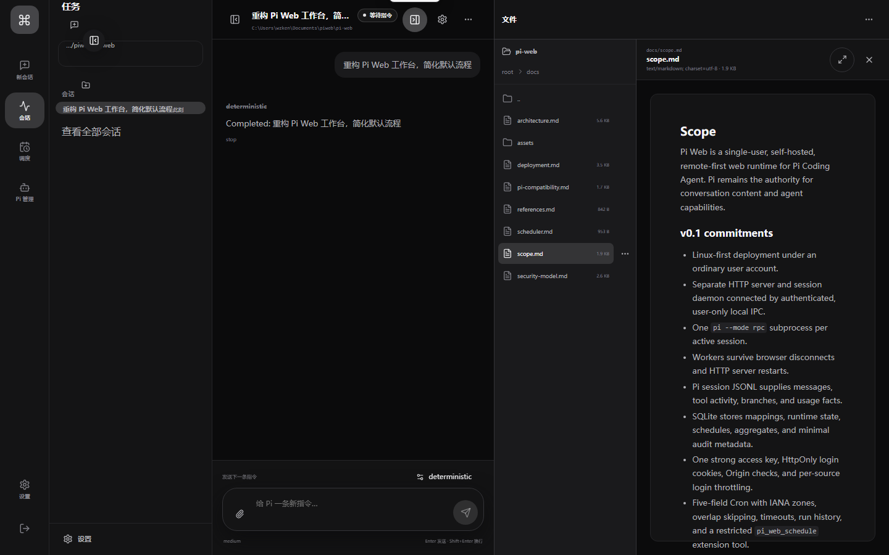
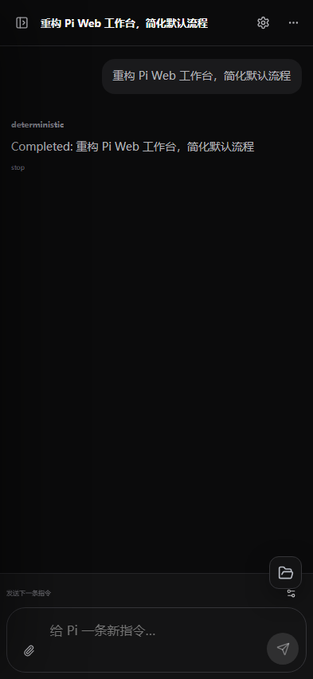

# Pi Web

[English](README.md) | [简体中文](README.zh-CN.md)

Pi Web 是面向 [Pi Coding Agent](https://pi.dev) 的单用户、自托管 Web
运行环境。它让 Pi 会话持续运行在真实项目目录中，并可通过电脑或手机浏览器进行
监督，同时继续使用 Pi 自身的会话格式和能力体系。

本项目基于 Pi 官方接口独立实现。[研究参考](docs/references.md)中的项目仅用于
产品决策研究，本仓库不包含它们的源码或品牌资源。

## 界面预览



<table>
  <tr>
    <td width="68%"></td>
    <td width="32%"></td>
  </tr>
  <tr>
    <td align="center">持久会话与工作区文件预览</td>
    <td align="center">移动端工作台</td>
  </tr>
</table>

## 主要功能

- Fastify Web 服务与长期运行的 sessiond 守护进程相互分离。
- 每个活动会话对应一个严格 JSONL 协议的 `pi --mode rpc` Worker。
- 支持提示、立即引导、后续排队、停止、模型和思考级别切换。
- 通过带 `projectionEpoch + sequence` 的事件重放或最新 Pi JSONL 快照恢复断线页面。
- 使用稳定的 Pi entry ID 分页完整活动分支；压缩标记与 `retainedTail` 当前上下文分离。
- 支持 Pi Extension UI 的选择、确认、输入、编辑和通知，刷新页面不会丢失等待中的交互。
- 持久监督收件箱统一展示等待决策、当前轮完成、Worker 异常和调度失败；未读与需处理状态会在已登录浏览器之间同步。
- 使用标准 VAPID/Web Push 提供后台提醒，支持逐设备订阅、有限重试、失效订阅清理和会话深链；锁屏只显示事件类型与会话或调度名称。
- 检测当前来源、私有局域网地址和已有的 Tailscale Serve HTTPS 地址，在服务端离线生成二维码并显示网络暴露警告；Pi Web 不会自动修改 Tailscale 或防火墙。
- 访问密钥登录、scrypt 哈希、HttpOnly Cookie、来源检查和登录节流。
- 受允许根目录约束的文件浏览、预览、上传、新建和重命名。
- 每个会话拥有受认证的 xterm.js 终端和移动端控制键。
- 五字段 Cron、IANA 时区、历史记录、重叠保护、超时和立即运行。
- 直接展示 Pi CLI 返回的版本、可用模型并仅管理用户级 Packages；项目级
  Packages、Skills、Extensions 和提示模板仍由每个 Pi Worker 根据项目上下文加载。
- 桌面与移动端响应式界面、命令面板、持久通知中心、后台 Push、远程入口二维码和 PWA。
- 支持跟随系统的简体中文与英文界面。
- 采用低干扰的 Coding Agent 工作台界面，并跟随操作系统自动切换亮色与深色。
- 侧栏按工作目录组织项目，并将最近聊天、Packages 插件入口和计划任务分开；
  项目与聊天区可折叠，完整历史通过“查看全部会话”进入。
- 移动端采用沉浸式聊天首页、全屏导航抽屉、大尺寸触控目标、真实附件/运行设置
  快捷操作和固定在底部的输入框；长按最近会话可以置顶、重命名或删除。
- Linux systemd 用户服务和非 root Docker Compose 部署。

## 环境要求

- Node.js 22.19 或更高版本。
- 使用源码构建时需要 pnpm 11。
- systemd 安装路径需要 Linux。
- 同一用户已经安装并配置 `@earendil-works/pi-coding-agent`。

当前兼容性基线为 Pi Coding Agent 0.84.1。真实 Worker 首次启动前会在中立目录执行
无模型 RPC 能力探测；单元、集成和 E2E 测试仍使用进程级假 Pi Worker，不需要
供应商凭据。

## 从源码快速启动

```bash
pnpm install --frozen-lockfile
pnpm build
pnpm pi-web start
```

首次在交互式终端启动时，Pi Web 会显示一次自动生成的访问密钥。请妥善保存，
打开 `http://127.0.0.1:8787`，再使用该密钥登录。Pi Web 会读取启动它的同一
操作系统用户下的 Pi 配置与供应商凭据。如果界面可以打开但无法创建 Pi 会话，
请执行 `pnpm pi-web doctor` 检查环境。

默认允许访问当前用户的主目录。如需把会话限制到指定项目目录，请在启动前设置
`PI_WEB_ALLOWED_ROOTS`。Linux 使用 `:` 分隔多个根目录，Windows 使用 `;`。

## 基本使用流程

1. 使用 Pi Web 访问密钥登录。
2. 在允许的根目录中选择工作目录、模型、思考级别和可选系统提示词，再创建会话。
3. 在会话页发送提示、立即引导当前轮次、排队后续消息或停止执行。
4. 浏览工作区文件和图片，或使用会话终端；浏览器断开不会停止 Pi Worker。
5. 在通知中心处理 Extension UI 决策、当前轮完成、Worker 异常和调度失败；通过 HTTPS 或本机回环地址访问时可以开启后台 Push。
6. 需要延时或重复执行提示时创建计划任务；每次运行都会新建 Pi 会话并记录结果。

## 本地开发

```bash
pnpm install --frozen-lockfile
pnpm build
# 终端 1
pnpm dev:sessiond
# 终端 2
pnpm dev:server
# 终端 3
pnpm dev:web
```

Vite 界面默认位于 `http://127.0.0.1:5173`，API 和 WebSocket 会代理到 8787
端口。首次使用新的运行目录时应先启动 sessiond，再启动 Server。

执行完整验证：

```bash
pnpm verify
pnpm test:e2e
pnpm audit --prod
```

单元测试和集成测试使用假 Pi Worker，不需要供应商凭据。Playwright 会启动独立的
有状态后端，并串行运行桌面端与移动端项目。变更与拉取请求要求见
[参与贡献](CONTRIBUTING.md)。

## 项目结构

| 路径 | 职责 |
| --- | --- |
| `apps/web` | React/Vite PWA、会话工作台、通知中心、Push 订阅界面、设置、文件、终端和计划任务界面 |
| `apps/server` | Fastify HTTP/WebSocket 边界、认证、Web Push 投递、远程地址检测、静态资源、文件 API 和 PTY |
| `apps/sessiond` | 持久会话与通知权威、SQLite 状态、Pi Worker 管理、IPC 和 Cron |
| `apps/cli` | 前台启动、诊断、访问密钥管理和 systemd 安装 |
| `packages/protocol` | 共享请求、事件与领域协议 |
| `packages/pi-rpc` | `pi --mode rpc` 的严格 JSONL 传输层 |
| `packages/pi-session-reader` | Pi 会话 JSONL 解析与快照重建 |
| `packages/config`、`packages/shared` | 配置、路径、安全辅助函数与共享状态逻辑 |
| `packages/scheduler-extension` | 用于管理计划任务的受限 Pi 扩展 |
| `tests`、`docs` | 端到端/集成测试和设计文档 |

浏览器只与 `apps/server` 通信。Server 通过仅当前用户可访问的本地 IPC，把认证后的
会话操作转发给 `apps/sessiond`；后者持有 SQLite，并为每个活动会话管理一个 Pi RPC
进程。Pi 自身的 JSONL 始终是对话内容的持久事实来源。恢复、所有权和协议细节见
[系统架构](docs/architecture.md)。

## 部署

在发布目录中安装 Linux 用户服务：

```bash
pnpm install --frozen-lockfile
pnpm build
pnpm pi-web install
pnpm pi-web doctor
```

也可以启动独立的 Docker 部署：

```bash
cp .env.docker.example .env
mkdir -p .runtime/docker/data .runtime/docker/pi workspaces
docker compose build
docker compose run --rm pi-web node dist/index.js set-password
docker compose run --rm --entrypoint pi pi-web
# 在 Pi 中执行 /login，完成后退出。
docker compose up -d
```

两种部署方式、Windows PowerShell 命令、可信远程访问、更新与备份说明都在
[部署指南](docs/deployment.md)中。

## CLI 命令

在已完成构建的源码目录中使用 `pnpm pi-web <command>`。

| 命令 | 用途 |
| --- | --- |
| `start` | 在前台同时运行 sessiond 与 Web 服务 |
| `server` / `sessiond` | 单独运行一个服务，用于开发或诊断 |
| `install` | 安装并启动 Linux systemd 用户服务 |
| `status` | 显示配置的访问地址；Linux 上同时显示 systemd 状态 |
| `stop` / `restart` | 停止或重启 Linux 用户服务；有活动 Worker 时默认拒绝，显式 `--force` 才会中断 |
| `doctor` | 检查 Node、Pi 0.84.1+ 兼容性、RPC 命令、SQLite、IPC、根目录、服务健康和网络暴露 |
| `set-password` | 通过隐藏输入设置自定义访问密码 |
| `reset-key` | 生成并持久化新访问密钥；按命令提示重启 Server |
| `uninstall` | 删除 systemd 服务单元但保留配置和数据；有活动 Worker 时需要 `--force` |
| `version` | 显示 Pi Web 版本 |

## 配置

环境变量的优先级高于配置文件。

| 设置 | 默认值 |
| --- | --- |
| `PI_WEB_HOST` | `0.0.0.0` |
| `PI_WEB_PORT` | `8787` |
| `PI_WEB_ALLOWED_ROOTS` | 当前用户主目录 |
| `PI_WEB_ALLOW_ANY_DIRECTORY` | `false` |
| `PI_WEB_DEFAULT_TIMEZONE` | `UTC` |
| `PI_WEB_DEFAULT_CRON_TIMEOUT_SECONDS` | `3600` |
| `PI_WEB_MINIMUM_CRON_INTERVAL_MINUTES` | `5` |
| `PI_WEB_MODEL_SCHEDULE_POLICY` | `allow` |
| `PI_WEB_PI_EXECUTABLE` | `pi` |
| `PI_WEB_ACCESS_KEY` | 自动生成；只持久化哈希 |
| `PI_WEB_TRUSTED_PROXY` | `false` |
| `PI_WEB_COOKIE_SECURE` | `auto` |
| `PI_WEB_DEFAULT_MODEL` | 未设置；使用 Pi 当前默认值 |
| `PI_WEB_DEFAULT_THINKING_LEVEL` | 未设置；使用 Pi 当前默认值 |
| `PI_WEB_DEFAULT_SYSTEM_PROMPT` | 未设置 |
| `PI_WEB_MAX_SCHEDULED_JOBS` | `200` |
| `PI_WEB_MAX_CONCURRENT_WORKERS` | `8` |
| `PI_WEB_EVENT_BUFFER_SIZE` | `2000` 个事件 |

默认从 `~/.config/pi-web/config.json`（或对应的 XDG 配置目录）读取配置，再由
环境变量覆盖。Linux 中多个允许根目录使用 `:` 分隔，Windows 使用 `;`。可通过
`PI_WEB_CONFIG_DIR`、`PI_WEB_DATA_DIR` 和 `PI_WEB_CACHE_DIR` 调整运行目录；
Docker Compose 已在容器内自动设置这些路径。

设置 `PI_WEB_ACCESS_KEY` 后，访问凭据由该环境变量管理，`set-password` 与
`reset-key` 会被禁用；请改动环境变量并重启 Server。`PI_WEB_ALLOW_ANY_DIRECTORY=true`
会主动关闭工作区根目录约束，不应作为普通的便利配置使用。

## 安全

> **Pi Web 不是安全沙箱。** Pi Worker 拥有启动它的用户或容器账号的权限。

Pi Web 不提供 HTTPS、VPN、公网中继或防火墙规则。不要把明文 HTTP 直接暴露到
不可信网络，应使用可信私网、SSH 隧道、已有的 Tailscale Serve HTTPS 地址或 HTTPS
反向代理。设置页会检测私有地址并生成二维码，但不会自动改变网络暴露状态。

后台 Push 需要安全浏览器上下文，即 HTTPS，或本地开发时的回环地址。VAPID 私钥与
Push 订阅保存在 sessiond 持有的 SQLite 中。重置访问密钥会撤销所有设备订阅，退出
登录会撤销当前设备订阅。Push 内容不得包含提示词、工具输出、路径、凭据或错误详情。

部署前请阅读[安全模型](docs/security-model.md)。漏洞报告流程见
[SECURITY.md](SECURITY.md)。

## 运行行为与限制

- 关闭浏览器或只重启 Web 服务不会停止由 sessiond 持有的 Pi Worker。
- 重启 sessiond 或主机会中断活动 Worker；Pi Web 不承诺工具执行中的无损恢复。
- `pi-web stop`、`restart`、`uninstall` 和 Pi Package 变更在存在活动 Worker 时默认拒绝；强制操作必须显式确认并写入审计。
- `waiting` 表示 Pi 可以继续接收输入，不代表整个会话已经结束。
- Linux 是正式支持的生产平台。
- 文件删除和覆盖暂不开放。
- 删除会话只会从 Pi Web 的会话索引中隐藏记录，不会删除 Pi 保存的原始 JSONL。
- Web 服务重启会终止其持有的终端进程。
- PWA 只缓存编译后的静态资源；Service Worker 负责认证后的 Push 深链，但不会离线保存通知或会话内容。

明确的非目标见[项目范围](docs/scope.md)，调度保证见
[调度器语义](docs/scheduler.md)。

## 文档

- [项目范围](docs/scope.md)
- [系统架构](docs/architecture.md)
- [架构决策](docs/decisions/README.md)
- [部署指南](docs/deployment.md)
- [安全模型](docs/security-model.md)
- [调度器](docs/scheduler.md)
- [Pi 兼容性](docs/pi-compatibility.md)
- [参与贡献](CONTRIBUTING.md)
- [研究参考](docs/references.md)

## 路线图

完成 v0.1 可靠性后：Git 状态与 diff 审阅、worktree 工作流、消息深链与分支、
更丰富的工具输出审阅和更深入的长会话性能基准。多用户、集群、SaaS 和通用
多 Agent 编排功能仍不在范围内。

## 许可证

[MIT](LICENSE)
